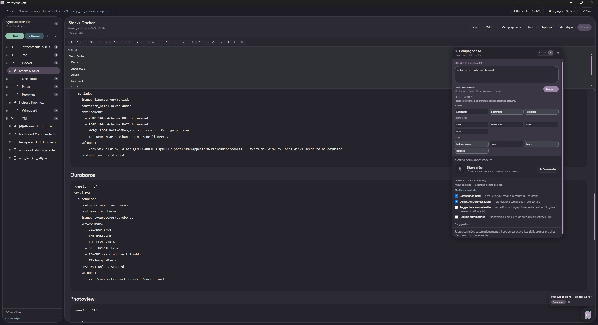

# CyberScribeNote

Application de prise de notes **100 % locale**, offline-first, avec IA via [Ollama](https://ollama.com), compagnon pixel **Scribe**, skills de conception de notes et design pastel minimaliste.

Dépôt : [github.com/nico2511/CyberScribeNote](https://github.com/nico2511/CyberScribeNote)  
Releases : [Releases](https://github.com/nico2511/CyberScribeNote/releases)

Basé sur le plan [CyberScribe Notes](Docs/CyberScribe_Notes_Plan.md) et inspiré de [CyberScribe](https://github.com/nico2511/CyberScribe) pour la partie vocale.



## Fonctionnalités (v0.5.x)

- Vault Markdown configurable (défaut `Documents/CyberScribeNote/vault` — changeable dans Réglages)
- **TXT → MD** : conversion des `.txt` / `.text` puis **suppression de la source** (notification) ; le jumeau suit les déplacements
- Supprimer une note `.md` **supprime aussi** le `.txt` / `.text` jumeau
- **Historique local** (snapshots, restauration) — clé SHA256 + migration lazy ; dossier `.history` masqué
- Arborescence : dossiers **repliés par défaut**, suppression dossiers vides, **renommage**, **glisser via poignée ⠿**
- Splash de bienvenue + **wizard Ollama** au premier lancement (install / démarrer / tirer un modèle)
- **Éditeur TipTap WYSIWYG** + menu contextuel, outline / TOC, wikilinks `[[Note]]`
- Frontmatter YAML : tags, date `updated` à la sauvegarde
- Thèmes **Light Pastel** / **Dark Pastel** + icône app Scribe
- Recherche rapide **Ctrl+T**
- **Compagnon IA** + menu **IA ▾** (résumer / reformuler / corriger / traduire / skills)
- Skills : Structurer, Sommaire, Lien (page / README GitHub), Points clés, Tags, Template, Brief, Plan, Notes liées (RAG), Wikiliens
- **RAG par vault** (`.rag/index.json` v2, réindex incrémentale)
- **Scribe** : tips, plans multi-skills (cerveau) et analyse de sélection ; dictée dans le prompt custom
- **Cerveau** : routeur de skills combinables hors menu IA ▾ — [Docs/Scribe_Cerveau_Skills.md](Docs/Scribe_Cerveau_Skills.md)
- Correction typo locale + Ollama / RAG optionnel
- Panneau **Réglages** (Ctrl+,) : vault, sync TXT, historique, Ollama, voix (sidecar vs Python)
- Images à la position du curseur (`_media/` par note)
- **Dictée PTT** : sidecar `voice_worker.exe` (priorité, VAD Silero inclus) ou Python
- Single-instance · Export `.md` · Import multi `.txt` · Import documents (PDF/Office/HTML → MD via [MarkItDown](https://github.com/microsoft/markitdown))
- Durcissement sécurité Tauri (sanitize Markdown, IPC `.md`, asset scope vault, SSRF)

## Téléchargement (Windows)

Sur la [page Releases](https://github.com/nico2511/CyberScribeNote/releases) :

| Asset | Contenu |
|-------|---------|
| **`CyberScribeNote-win.zip`** (recommandé) | `cyberscribe-note.exe` + `voice_worker.exe` + `tools/` (MarkItDown) — dézipper, lancer l’app |
| `cyberscribe-note.exe` seul | App seule → dictée via **Python** si pas de sidecar à côté |
| `voice_worker.exe` | Sidecar vocal (~190 Mo) à placer **dans le même dossier** que l’app |

- Les **modèles Whisper** se téléchargent au premier usage dans `Documents/CyberScribeNote/models/`.
- **Import PDF/Office** : Python 3.10+ + **Réglages → Import documents → Installer MarkItDown** (le dossier `tools/` doit rester à côté de l’exe).
- Linux / macOS : pas de binaire prêt pour l’instant (build source + Python pour la voix).
- Le worker est local (stdin/stdout, pas de serveur ouvert). Binaire non signé → SmartScreen possible.

## Soutenir / dons

Si le projet vous est utile, vous pouvez soutenir via Bitcoin (BTC) :

```
bc1pt20cczcmvukrny4pru3x2nc522tk2sectlu22d42q2ltyau7t66suh6kqx
```

(Adresse également affichée dans Réglages.)

## Prérequis (dev)

- [Node.js](https://nodejs.org/) 18+
- [Rust](https://www.rust-lang.org/tools/install)
- [Python 3.10+](https://www.python.org/) (si pas de sidecar)
- [Ollama](https://ollama.com) (optionnel, IA / RAG)

### Dépendances vocales

**Option A — Sidecar (recommandé pour les utilisateurs)**  
Télécharger le zip de release, ou builder :

```powershell
.\voice\build_sidecar.ps1
```

Produit `voice/voice_worker.exe` (+ copie sous `src-tauri/binaries/`). L’app le préfère à Python.

**Option B — Python (dev)**  
```bash
pip install -r voice/requirements.txt
```
Ou via l’app : **Réglages → Voix → Installer dépendances (pip)** (uniquement en mode Python).

Logs worker : `Documents/CyberScribeNote/voice_worker.log`.

### Import documents (MarkItDown)

Conversion PDF / Word / PowerPoint / Excel / HTML / EPUB → note `.md` (bouton **Doc** dans la barre latérale).

```bash
pip install -r tools/requirements-markitdown.txt
```

Ou via l’app : **Réglages → Import documents → Installer MarkItDown (pip)** (Python 3.10+ requis).

## Démarrage

```bash
npm install
npm run tauri dev
```

## Tests

```bash
npm test
cd src-tauri && cargo test
```

## Build

```bash
npm run tauri build
```

Sortie : `src-tauri/target/release/cyberscribe-note.exe`  
*(bundle / installateur NSIS volontairement désactivé — `bundle.active: false`.)*

## Troubleshooting

### Voix / « Scribe, … »
1. Réglages → Voix : vérifier le **mode** (Sidecar .exe ou Python).
2. **Appliquer la config voix**, attendre « Dictée prête » / modèle chargé.
3. PTT : hotkey → parler → rappuyer. Commandes **pendant** l’enregistrement.
4. Prompt custom : focus le champ Compagnon, puis dictez.
5. Si échec : `Documents/CyberScribeNote/voice_worker.log`.

### Sync TXT qui recrée une note
- Supprimer la note **depuis l’app** : le `.txt` jumeau part avec. Sinon le sync recrée le `.md`.

### Glisser-déposer notes
- Poignée **⠿** → déposer sur un dossier (ou « racine »).

### Enrichir un lien GitHub
- Skill **Lien** : README brut via `raw.githubusercontent.com`.

### Ollama
- Réglages → démarrer / tirer un modèle. RAG : aussi `nomic-embed-text`, puis réindexer.
- Au démarrage, l’app relance Ollama s’il est arrêté (sous Windows : app tray `Ollama.exe` ; `ollama serve` seulement si le CLI est seul).
- Chemin des modèles : géré par Ollama (`OLLAMA_MODELS` + sous Windows *Settings → Model location*). CyberScribe ne stocke pas les LLM ; ne lance pas tray + `serve` en même temps.

## Stack

| Couche | Technologie |
|--------|-------------|
| Desktop | Tauri 2 (+ single-instance) |
| Frontend | Svelte 5 + TypeScript + Tailwind CSS 4 + TipTap |
| Backend | Rust (FS vault, Ollama HTTP, RAG, fetch web) |
| Voix | Sidecar PyInstaller ou Python (`faster-whisper`), PTT |
| Stockage | Fichiers `.md` + médias + `.history` local |

## Roadmap

1. ~~Vague 1 skills + buddy + enrich liens~~ (v0.3)
2. ~~Sync TXT, historique notes, sidecar vocal clarifié~~ (v0.4)
3. ~~Sécurité Tauri, rename, RAG par vault, stores, wizard Ollama~~ (v0.5)
4. ~~Refactor audit + indexer dossier + CI release Windows~~ (v0.5.5)
5. ~~Fix démarrage Ollama Windows (chemin modèles / pas de 2e serve)~~ (v0.5.6)
6. ~~Auto-start Ollama + prompts custom extraction (favoris)~~ (v0.5.7)
7. ~~Import documents MarkItDown (PDF / Office → MD)~~ (v0.5.8)
8. Cerveau Scribe : skills combinables (routeur + plans du buddy)
9. Templates / graph · E2E Tauri
10. Bundling NSIS + updater (+ Authenticode) · builds Linux

Détail plan : [Docs/CyberScribe_Notes_Plan.md](Docs/CyberScribe_Notes_Plan.md).

## Licence

MIT
